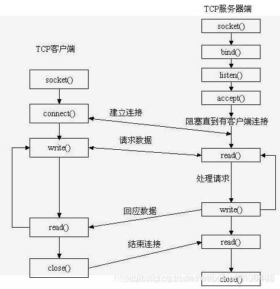

# Socket

## 什么是Socket？

Socket可以理解为一组API，为应用层提供的一组发送、接收TCP/IP层报文的接口。  
Socket API由操作系统提供实现。Java、C#等语言的Socket接口就是调用的操作系统提供的Socket API实现。  

> 现在几乎所有的网络应用程序（进程）之间的通信，底层用的都是UNIX BSD的套接字(socket)。  
> 以前还有用UNIX System V的TLI来实现网络进程间通信，但现在已经被淘汰。  
> 因此也可以说一切皆为socket。  

## Socket的工作原理

## Socket的基本API

**int socket(int domain, int type, int protocol);**

作用：  
为当前进程创建socket，用于与其他进程通信。  

入参：  
domain ---协议族，决定了socket的地址类型，在通信中必须采用对应的地址  
type ---socket类型（SOCK_STREAM、SOCK_DGRAM、SOCK_RAW、SOCK_PACKET、SOCK_SEQPACKET等）  
protocol ---协议（TCP、UDP、SCTP等）  

出参：  
socket描述符（可以理解为一个ID）    

**int bind(int sockfd, const struct sockaddr addr, socklen_t addrlen);**  

作用：  
将当前socket绑定到某个端口，赋予socket唯一的一个“网络地址”。

> 可以通过 “网络协议+ip+端口号”唯一标识任何的一个网络进程。

入参：  
sockfd ---socket描述符  
addr ---指向要绑定给sockfd的协议地址  
addrlen ---对应的是协议地址的长度  

出参：  
略  

> 服务端一般需要指定端口来提供服务，但客户端不用。因此服务端socket()后一般需要调用bind()  
> 而客户端不用；客户端在connect()时会自动分配一个端口号

**listen()、connect()函数**  

作用：  
服务端通过listen()监听端口，等待客户端与自己建立连接；  
客户端则通过connect()与服务端建立连接。  

**int accept(int sockfd, struct sockaddr *addr, socklen_t *addrlen);**

作用：  
建立连接后，服务端便可以通过accept()函数获取客户端的请求。  
accept成功后，会返回一个全新的socket套接字。  

> socket()返回的是“监听套接字”。该套接字在服务器的生命周期中一直存在；  
> accept()返回的是“已连接的套接字”。当与客户端通信完毕，该套接字便会被关闭；  
> **为什么建立连接后要返回一个新的套接字？**  
> 考虑到服务端需要同时服务多个客户端。  
> 服务端收发消息（IO操作）会阻塞进程，若只用一个套接字，会极大影响服务端的性能；  
> 使用新的套接字，则可以方便进程建立新线程去处理新的客户端请求。不会阻塞进程与其他客户端建立连接。    

**网络I/O操作 API**  
包括：  
read()/write()  
recv()/send()  
readv()/writev()  
recvmsg()/sendmsg()  
recvfrom()/sendto()  

作用：  
发送消息and接收消息。  

## 网络I/O详解

上面提到的网络IO API，默认情况下都是阻塞型的。  
即服务器在调用read()方法时，主线程会阻塞，直至客户端发送完消息，应用从内核中取到数据，才会继续运行后面的代码。  
这种也被称为**阻塞型IO模型**。  
现在还有以下几种流行的网络IO模型：  
* 非阻塞 IO（non-blocking IO）
* 多路复用 IO（IO multiplexing）
* 异步 IO（Asynchronous I/O）
* 信号驱动 IO（signal driven I/O， SIGIO）

下面我们来解读一下各种IO模型的特点。

### 阻塞型IO模型

因为每次read()都会阻塞线程，因此每次有请求进来，都需要新开一个线程去处理，即1个线程：1个请求。

这种模型只适合并发量小的应用，并发量大时需要创建大量线程去处理请求，内存、线程开销非常大。  

### 非阻塞 IO（non-blocking IO）

同样是通过read()接收请求，但在调用前使用"fcntl( fd, F_SETFL, O_NONBLOCK );"命令将read()变为非阻塞。  

非阻塞的read()调用后，若内核中该请求的数据未准备好，便立即返回，不会阻塞线程。  

这样便可以通过1个线程去轮询哪个socket的数据已准备好，准备好的才开新线程去处理数据。  

### 多路复用 IO（IO multiplexing）

多路复用这个名字可能比较陌生，但是说到"select/epoll"可能就比较熟悉了。  

在这个模型中，使用select()代替read()，去监听用户的请求数据。  

select()方法是阻塞的，但它能同时监听所有已注册的socket的动作，当有socket准备好后，便返回。  

