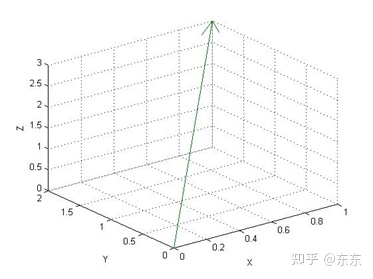
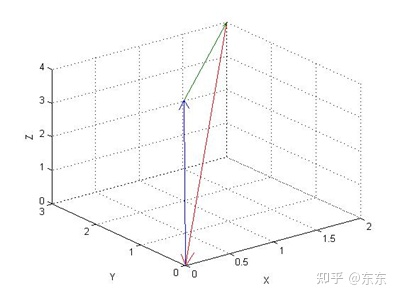
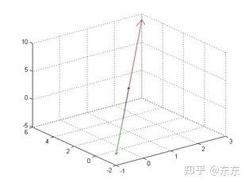
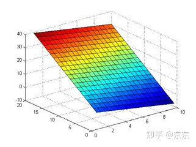
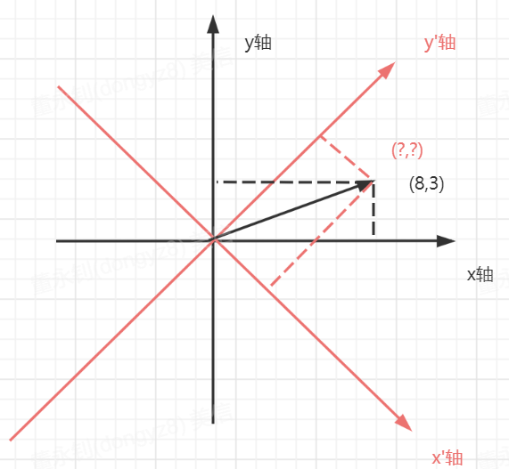

# 线性代数

## 参考资料 

机器学习的数学基础（知乎：东东）：[https://www.zhihu.com/column/c_1353118642033336320](https://www.zhihu.com/column/c_1353118642033336320)  
markdown数学公式（CSDN：LP学长）：[https://blog.csdn.net/Liu_PiPiPi/article/details/121613743](https://blog.csdn.net/Liu_PiPiPi/article/details/121613743)  
宋浩老师《线性代数》高清教学视频：b站搜索

## 概览
线性代数研究什么？   
研究**行列式**、**矩阵**、**向量**；  

线性代数的应用？  

## 行列式（determinant）

### 1. 二阶行列式

将a,b,c,d四个数，写成这种式子：$ \begin{vmatrix} a & b \\ c & d \end{vmatrix}$  

就称为一个二阶行列式（second-order determinant）。二阶指的是有两行、两列。  

一般也会用带有下标的变量表示：：$ \begin{vmatrix} a_{11} & a_{12} \\ a_{21} & a_{22} \end{vmatrix}$  
下标第一个数称为**行标**；表示这个数在第几行。    
下标第二个数称为**列标**；表示这个数在第几列。  
比如，$a_{21}$表示在第2行第1列。  

#### 二阶行列式的按对角线展开

所谓二阶行列式展开，就是将行列式展开成多项式：$ \begin{vmatrix} a & b \\ c & d \end{vmatrix} = a \times d - b \times c$  

我们可以用“对角线法”去求二阶行列式展开后的多项式（polynomial）。  

就是用左上角与右下角相乘，再减去左下角与右上角相乘的值，就可以求得二阶行列式的展开式。  

展开之后，得到的多项式便为：$ a \times d - b \times c$ 。  

> 可以理解为：二阶行列式就是这个多项式$ a \times d - b \times c$的简易写法（虽然看上去没简易多少，但继续往下看三阶行列式，就会发现确实简易了。）  

### 2. 三阶行列式

$ \begin{vmatrix} 1 & 2 & 3  \\ 4 & 5 & 6 \\ 7 & 8 & 9 \end{vmatrix}$有3行3列，被称为一个三阶行列式（Tertiary determinant）。

#### 三阶行列式的按对角线展开

同样可以用“对角线法”，求三阶行列式展开后的多项式。  

先将上面的行列式，想象成这样：$ \begin{vmatrix} 1 & 2 & 3 & 1 & 2 & 3  \\ 4 & 5 & 6 & 4 & 5 & 6 \\ 7 & 8 & 9 & 7 & 8 & 9 \end{vmatrix}$

1. 先是从左到右：  
&nbsp;  
左上角到右下角： $1 \times 5 \times 9 $   
然后下一列：$2 \times 6 \times 7 $   
再下一列： $3 \times 4 \times 8 $   
&nbsp;   
得到3个项，将它们相加：  
$1 \times 5 \times 9 + 2 \times 6 \times 7 + 3 \times 4 \times 8 \tag{1}$  

2. 然后从右到左：
&nbsp;   
右上角到左下角： $3 \times 5 \times 7 $   
然后上一列：$2 \times 4 \times 9 $   
再上一行： $1 \times 6 \times 8 $   
&nbsp;   
得到3个项，将它们相加：  
$3 \times 5 \times 7 + 2 \times 4 \times 9 + 1 \times 6 \times 8 \tag{2}$  

3. 最后，将(1)和(2)相减，就得到三阶行列式的展开式：

$\begin{vmatrix} 1 & 2 & 3  \\ 4 & 5 & 6 \\ 7 & 8 & 9 \end{vmatrix} = 1 \times 5 \times 9 + 2 \times 6 \times 7 + 3 \times 4 \times 8  - (3 \times 5 \times 7 + 2 \times 4 \times 9 + 1 \times 6 \times 8)$  

### 3. 排列  

在介绍多阶行列式之前，我们需要先了解一下排列(arrange)的概念。  

由1,2...n 这n个数组成的一个有序数组，叫n级排列。1,2...n中，每个数都要出现，才算n级排列。（比如[1345]就不是1,2,3,4,5的一个n级排列）  

**逆序（reverse order）**：大数在小数前面，就叫逆序。  
比如1,2,3,4有一个n级排列：[4132]，4在1前面，就是逆序。  

**逆序数（Reverse order number）**：排列中存在多少次逆序，就称为一个排列的逆序数。用N(1,2,...n)表示  
还是[4132]，4在第1，它比1、3、2都大，所以产生了3次逆序；然后还有3比2大，产生了1次逆序。所以最后算得，[4132]这个排列的逆序数为3+1=4

**偶排列（even permutation）**：逆序数为偶数的排列  

**奇排列（odd permutation）**：逆序数为奇数的排列  

**标准排列**：逆序数为0的排列。如N(1,2,...n)  

**对换**：排列中的两个数交换位置，就叫对换  
> 对换后，排列的奇偶性会发生改变。  

### 4. n阶行列式  

有n行、n列的行列式，就叫n阶行列式。  

#### n阶行列式的展开  

如果再用对角线法，也可以，但是麻烦；因此我们从3阶行列式找找规律：  

$\begin{vmatrix} a_{11} & a_{12} & a_{13}  \\ a_{21} & a_{22} & a_{23} \\ a_{31} & a_{32} & a_{33} \end{vmatrix} 
= a_{11} \times a_{22} \times a_{33} + 
a_{12} \times a_{23} \times a_{31} + 
a_{13} \times a_{21} \times a_{32}  - 
(a_{13} \times a_{22} \times a_{31} +
 a_{12} \times a_{21} \times a_{33} +
  a_{11} \times a_{23} \times a_{32})$  

展开后，一共有6个项。  
$a_{11} \times a_{22} \times a_{33}$  
$a_{12} \times a_{23} \times a_{31}$  
$a_{13} \times a_{21} \times a_{32}$  
$a_{13} \times a_{22} \times a_{31}$  
$a_{12} \times a_{21} \times a_{33}$  
$a_{11} \times a_{23} \times a_{32}$  

可以看到：  
行标的排列都是标准排列（123）；
列标的排列取排列的所有可能。  

再看列标的排列：  
123 偶排列  
231 偶排列  
312 偶排列   
321 奇排列  
213 奇排列  
132 奇排列  
我们发现，正项（符号为+）的列标的排列都是偶排列；负项（符号为-）的列标的排列都是奇排列。  

拓展到n阶行列式，我们便可以根据以上规律，求得n阶行列式的**按行展开定义**：  
**行标取标准排列；**  
**列标取排列的所有可能。**  
**不同行不同列取出来的元素相乘，符号由列标排列的奇偶性决定；（列标的排列为偶排列的为正项；列标的排列为奇排列的为负项）**  

相应的，也会有n阶行列式的**按列展开定义**，两种定义求出来的多项式，均是对的：  
**列标取标准排列；**  
**行标取排列的所有可能。**  
**不同行不同列取出来的元素相乘，符号由行标排列的奇偶性决定；（行标的排列为偶排列的为正项；行标的排列为奇排列的为负项）**  

一般用大写字母D来表示行列式的值（determinant的首字母）；

我们也可以总结得出：n阶行列式展开后多项式有n!项。  

### 5. 行列式的性质 

转置（transpose），意思就是行转列、列转行（用$D^T$表示）。  

$D = \begin{vmatrix} 1 & 2 & 3  \\ 4 & 5 & 6 \\ 7 & 8 & 9 \end{vmatrix}$ -> $ D^T = \begin{vmatrix} 1 & 4 & 7  \\ 2 & 5 & 8 \\ 3 & 6 & 9 \end{vmatrix}$

性质1： $D^T = D$ 。即转置的行列式展开后与原来的行列式相等。  

性质2：两行互换，值的符号改变。

性质3（性质2的推论）：两行（列）相等，行列式的值D = 0。  

性质4：某一行都乘以K，等于行列式乘以K。  $D = \begin{vmatrix} 1 & 2 & 3  \\ 4k & 5k & 6k \\ 7 & 8 & 9 \end{vmatrix} = k \begin{vmatrix} 1 & 2 & 3  \\ 4 & 5 & 6 \\ 7 & 8 & 9 \end{vmatrix}$

性质5：两行（列）对应成比例，行列式的值D = 0。

性质5的推论：当有一行全为0，行列式的值D = 0。  

性质6：某个行列式，有一行为两个值相加，则值可以拆成两个行列式相加的形式。  
例子：$D = \begin{vmatrix} 1 & 2 & 3  \\ 4+5 & 5+8 & 6+2 \\ 7 & 8 & 9 \end{vmatrix} =  \begin{vmatrix} 1 & 2 & 3  \\ 4 & 5 & 6 \\ 7 & 8 & 9 \end{vmatrix} + \begin{vmatrix} 1 & 2 & 3  \\ 5 & 8 & 2 \\ 7 & 8 & 9 \end{vmatrix}$

性质7：某一行乘以一个数，加到另一行上，行列式的值D不变。  

### 6. 行列式的按行展开

【余子式】  

假设有以下行列式：$D = \begin{vmatrix} 1 & 2 & 3 & 10  \\ 4 & 5 & 6 & 11 \\ 7 & 8 & 9 & 12 \\ 13 & 14 & 15 & 16\end{vmatrix}$  

那么它第3行第2列的元素对应的**余子式**为：$M_{32} = \begin{vmatrix} 1 & 3 & 10  \\ 4 & 6 & 11 \\ 13 & 15 & 16\end{vmatrix}$  

即把行列式D的第3行以及第2列上的元素去掉，得到的新的行列式就为新的余子式，**用$M_{32}$表示（3，指第3行；2指第2列）**。  

【代数余子式】  

接上，第3行第2列的元素对应的**代数余子式**为：$A_{32} = (-1)^{(3+2)} \begin{vmatrix} 1 & 3 & 10  \\ 4 & 6 & 11 \\ 13 & 15 & 16\end{vmatrix}$  
代数余子式用**$A_{ij}$表示**。 

【行列式的第二种定义】

$D = a_{i1}A_{i1} + a_{i2}A_{i2} + ... + a_{in}A_{in}$  

其中，$a_{i1}$ 是指在行列式第i行、第1列的元素，$A_{i1}$是指第i行、第1列的元素的代数余子式。  

简单来说，就是指行列式的值，等于行列式任意一行的所有元素以及其代数余子式的积的总和。  

这种换算，也叫行列式的**按行展开**。  

> 在按行展开时，选择0比较多的行去展开，计算会比较方便。  

【异乘变零定理】  

某行元素与另一行元素的代数余子式的乘积之和必定为0。  

> 如何证明？

证明：  

假设有$D = \begin{vmatrix} 1 & 2 & 3 & 10  \\ 4 & 5 & 6 & 11 \\ 7 & 8 & 9 & 12 \\ 13 & 14 & 15 & 16\end{vmatrix}$  

第四行元素与第一行的代数余子式异乘：  
$D' = 13 \times (-1)^{1+1} \times \begin{vmatrix} 5 & 6 & 11  \\ 8 & 9 & 12 \\ 14 & 15 & 16\end{vmatrix} + 
14 \times (-1)^{1+2} \times \begin{vmatrix} 4 & 6 & 11  \\ 7 & 9 & 12 \\ 13 & 15 & 16\end{vmatrix} +
15 \times (-1)^{1+3} \times \begin{vmatrix} 4 & 5 & 11  \\ 7 & 8 & 12 \\ 13 & 14 & 16\end{vmatrix} +
16 \times (-1)^{1+4} \times \begin{vmatrix} 4 & 5 & 6  \\ 7 & 8 & 9 \\ 13 & 14 & 15\end{vmatrix}$  

我们再将D第一行的元素变为第四行，得到一个新的行列式B：  
$B = \begin{vmatrix} 13 & 14 & 15 & 16  \\ 4 & 5 & 6 & 11 \\ 7 & 8 & 9 & 12 \\ 13 & 14 & 15 & 16\end{vmatrix}$  

对B按第一行展开，我们可以发现，展开式与D'相同：  
$B = 13 \times (-1)^{1+1} \times \begin{vmatrix} 5 & 6 & 11  \\ 8 & 9 & 12 \\ 14 & 15 & 16\end{vmatrix} + 
14 \times (-1)^{1+2} \times \begin{vmatrix} 4 & 6 & 11  \\ 7 & 9 & 12 \\ 13 & 15 & 16\end{vmatrix} +
15 \times (-1)^{1+3} \times \begin{vmatrix} 4 & 5 & 11  \\ 7 & 8 & 12 \\ 13 & 14 & 16\end{vmatrix} +
16 \times (-1)^{1+4} \times \begin{vmatrix} 4 & 5 & 6  \\ 7 & 8 & 9 \\ 13 & 14 & 15\end{vmatrix}$  

根据性质3，B = 0 ，因此有D' = B = 0。  

【拉普拉斯定理】  

2阶子式：往任意相邻2行、任意相邻2列画1直线，直线交叉的元素形成的一个行列式，就是2阶子式；（k阶同理）  

2阶余子式：往任意相邻2行、任意相邻2列画1直线，没有直线经过的元素形成的一个行列式，就是2阶余子式；（k阶同理）  

2阶代数余子式：$(-1)^{第一行号+第二行号+第一列号+第二列号}$ x 2阶余子式  

拉普拉斯定理：取定k行，由k行元素组成的所有k阶子式与k阶代数余子式的乘积之和 = D 。  

### 7. 行列式的计算 

求行列式的值，有以下比较好的计算思路：  

#### (1)简化成上三角行列式
* 根据性质2、性质4、性质7，将行列式简化成“上三角行列式”（即对角线以下的元素均为0，不包括对角线上的元素）  
* 行列式的值便等于对角线元素的乘积。  

【示例1】  

$D = \begin{vmatrix} 6 & 12 & 18 & 24  \\ 4 & 5 & 6 & 11 \\ 7 & 8 & 9 & 12 \\ 13 & 14 & 15 & 16\end{vmatrix}$  

要将D变为上三角行列式，我们要做的就是将a21,a31,a32,a41,a42,a43这几个值变为0。  

1. 我们可以先将a11变为1，方便计算。方法是将第一行的元素同时乘以$\frac{1}{6}$，得：  
$D = 6 \times \frac{1}{6} \times \begin{vmatrix} 6 & 12 & 18 & 24  \\ 4 & 5 & 6 & 11 \\ 7 & 8 & 9 & 12 \\ 13 & 14 & 15 & 16\end{vmatrix} = 
6 \times \begin{vmatrix} \frac{1}{6} \times 6 & \frac{1}{6} \times 12 & \frac{1}{6} \times 18 &  \frac{1}{6} \times 24  \\ 4 & 5 & 6 & 11 \\ 7 & 8 & 9 & 12 \\ 13 & 14 & 15 & 16\end{vmatrix} = 
6 \times \begin{vmatrix} 1 & 2 & 3 &  4  \\ 4 & 5 & 6 & 11 \\ 7 & 8 & 9 & 12 \\ 13 & 14 & 15 & 16\end{vmatrix}
$  

2. 开始计算。  

a21:将第一行的值乘以-4，加到第二行，根据性质7，D的值不变，同时可以将a21变为0；  
$D = 6 \times \begin{vmatrix} 1 & 2 & 3 & 4  \\ 4 + (-4) & 5 + (-8) & 6 + (-12) & 11 + (-16) \\ 7 & 8 & 9 & 12 \\ 13 & 14 & 15 & 16\end{vmatrix} = 
\begin{vmatrix} 1 & 2 & 3 & 4  \\ 0 & -3 & -6 & -5 \\ 7 & 8 & 9 & 12 \\ 13 & 14 & 15 & 16\end{vmatrix}
$  

a31:将第一行的值乘以-7，加到第三行：  
$D = 6 \times \begin{vmatrix} 1 & 2 & 3 & 4  \\ 0 & -3 & -6 & -5 \\ 0 & -6 & -13 & -16 \\ 13 & 14 & 15 & 16\end{vmatrix}$  

a32:将第二行的值乘以-2，加到第三行：  
$D = 6 \times \begin{vmatrix} 1 & 2 & 3 & 4  \\ 0 & -3 & -6 & -5 \\ 0 & 0 & -1 & -6 \\ 13 & 14 & 15 & 16\end{vmatrix}$  

a41:将第一行的值乘以-13，加到第四行：
$D = 6 \times \begin{vmatrix} 1 & 2 & 3 & 4  \\ 0 & -3 & -6 & -5 \\ 0 & 0 & -1 & -6 \\ 0 & -12 & -24 & -32\end{vmatrix}$  

a42:将第二行的值乘以-4，加到第四行：
$D = 6 \times \begin{vmatrix} 1 & 2 & 3 & 4  \\ 0 & -3 & -6 & -5 \\ 0 & 0 & -1 & -6 \\ 0 & 0 & 0 & -12\end{vmatrix}$  

a43:刚好为0，不用计算。（若不为0，则用第3行的值乘以一个数，加到第四行，时a43为0）  
$D = 6 \times \begin{vmatrix} 1 & 2 & 3 & 4  \\ 0 & -3 & -6 & -5 \\ 0 & 0 & -1 & -6 \\ 0 & 0 & 0 & -12\end{vmatrix}$  

3. 将对角线元素相乘，最终得：$D = 6 \times 1 \times -3 \times -1 \times -12 = -216 $  

【示例2】  
如下行列式，假设a11为0，就无法用上面这种方法，该怎么办？  
$D = \begin{vmatrix} 0 & 12 & 18 & 24  \\ 4 & 5 & 6 & 11 \\ 7 & 8 & 9 & 12 \\ 13 & 14 & 15 & 16\end{vmatrix}$    

我们可以根据性质2：两行互换，行列式符号改变，将ai1不为0的行换到第一行，再用上面示例1的方法求值即可。  

#### (1)某一行的0特别多时：
直接对该行某个不为0的元素按行展开，然后计算。  

【示例3】  

$D = \begin{vmatrix} 6 & 12 & 18 & 24  \\ 4 & 5 & 6 & 11 \\ 0 & 8 & 0 & 0 \\ 13 & 14 & 15 & 16\end{vmatrix}$  
我们可以看到，以下行列式，第3行有很多0，因此，我们可以对a32按行展开：  
$D = 0 \times A31 + 8 \times A32 + 0 \times A33 + 0 \times A34 = 8 \times A32$  
然后对A32（a32的代数余子式）求值即可。    

#### (3)加边法
略  

#### (4)范德蒙行列式(Vandermonde determinant)  

范德蒙行列式：$ \begin{vmatrix} 1 & 1 & 1 & 1 & ... & 1 \\ x_1 & x_2 & x_3 & x_4 & ... & x_n \\ x_1^2 & x_2^2 & x_3^2 & x_4^2 & ... & x_n^2 \\ ... \\ x_1^{n-1} & x_2^{n-1} & x_3^{n-1} & x_4^{n-1}  & ... & x_n^{n-1}\end{vmatrix}$   

若行列式满足范德蒙行列式，则它的值 $D = \prod{}{1<=j<i<=n}(x_i-x_j) $  

假设有$ \begin{vmatrix} 1 & 1 & 1 & 1  \\ x_1 & x_2 & x_3 & x_4 \\ x_1^2 & x_2^2 & x_3^2 & x_4^2 \\ x_1^3 & x_2^3 & x_3^3 & x_4^3 \end{vmatrix}$   

则它的值$D = (x_2 - x_1) \times (x_3 - x_1) \times (x_4 - x_1) \times (x_3 - x_2) \times (x_4 - x_2) \times (x_4 - x_3)$

#### (5)对称行列式、反对称行列式  

$D = \begin{vmatrix} 4 & 1 & 2 & 3  \\ 1 & 3 & 5 & 6 \\ 2 & 5 & 2 & 8 \\ 3 & 6 & 8 & 1\end{vmatrix}$  
上面是一个**对称行列式**，它有以下特点：  
* 主对角线上的值可以为任意值
* 上下元素对应相等，即aij = aji  

$D = \begin{vmatrix} 0 & 1 & 2 & 3  \\ -1 & 0 & 5 & 6 \\ -2 & -5 & 0 & -8 \\ -3 & -6 & 8 & 0\end{vmatrix}$  
上面是一个**反对称行列式**，它有以下特点：  
* 主对角线上的值都为0
* 上下元素对应成相反数，即aij = -aji  

性质：奇数阶的反对称行列式 ，D = 0  

### 8.克莱姆法则(cramer)  

克莱姆法则，是用行列式（或矩阵）的方式，去解n元的方程组。  

【定义】  
对于一个n元n个方程组，若它的系数行列式不为0，则方程组的解则$x_i = \frac{D_i}{D}$   

【解释】
假设有以下三元方程组：  
$\begin{cases}
x_1 + x_2 + x_3 = 1 \\
x_1 - x_2 + 5x_3 = 6 \\
-x_1 + x_2 + 6x_3 = 9 \\
\end{cases}$  

我们将方程组的系数，做成一个**系数行列式**：  
$D = \begin{vmatrix} 1 & 1 & 1 \\  1 & -1 & 5 \\  -1 & 1 & 6 \end{vmatrix}$  

D = ? !=0
此时，可以使用克莱姆法则对$x_1,x_2,x_3$求解。  
$x_1 = \frac{D_1}{D}$  
$x_2 = \frac{D_2}{D}$  
$x_3 = \frac{D_3}{D}$  

其中 $D_1$ 的意思是将方程组右边的值(1,6,9)，替换行列式D第1列后，形成的新的行列式：$D_1 = \begin{vmatrix} 1 & 1 & 1 \\  6 & -1 & 5 \\  9 & 1 & 6 \end{vmatrix}$  
同理 $D_2$是替换行列式D第2列后，形成的新的行列式：$D_2 = \begin{vmatrix} 1 & 1 & 1 \\  1 & 6 & 5 \\  -1 & 9 & 6 \end{vmatrix}$    

但克莱姆法则有**使用条件**：
* 必须是n个方程，n个变量  
* D!=0  

> 克莱姆法则计算量比较大，因此一般不使用。  

【推论】
**对于齐次方程组，若方程个数=未知量个数，D!=0，则齐次方程组只有零解。($x_1=x_2=...=x_n=0$)**  
反过来说也成立：**对于齐次方程组，若方程个数=未知量个数，齐次方程组有非零解，则D=0**     

齐次方程组，即等号右边都为0的方程组：  
$\begin{cases}
x_1 + x_2 + x_3 = 0 \\
x_1 - x_2 + 5x_3 = 0 \\
-x_1 + x_2 + 6x_3 = 0 \\
\end{cases}$  

&nbsp;   
&nbsp;  
&nbsp;  
&nbsp;  
&nbsp;  
&nbsp;   
&nbsp;  
&nbsp;  
&nbsp;  
&nbsp;  

## 矩阵(matrix) 

### 1. 什么是矩阵

1. 矩阵的应用

  * 解线性规划问题。
    1. 某工厂要用三种原料1、2、3混合调配出三种不同规格的产品甲、乙、丙，数据如表所示。问:该厂应如何安排生产，使利润收入为最大?
    2. 某钢管零售商从钢管厂进货，将钢管按照顾客的需求切割后售出。从钢管厂进货时得到原料钢管都是19m长。现有一客户需要50根4m长，20根6m长和15 根8m长的钢管，应如何下料最节省?

  * 解线性方程。  
    见克莱姆法则。

  * 最小二乘拟合。

2. 矩阵的定义

跟行列式类似，是由m行n列的元素组成。矩阵用$A_{mn}$表示，第m行、第n列上的元素则同样用$a_{mn}$表示。  

3. 矩阵与行列式的区别 

| |行列式|矩阵|
|---|---|---|
|本质|是一个数（行列式最后求值都能得到一个数）|是一些数组成的表|
|符号|用两根竖线表示：$\begin{vmatrix} 1 & 1 & 1 \\  1 & -1 & 5 \\  -1 & 1 & 6 \end{vmatrix}$    |用小括号或者中括号表示：$\begin{pmatrix} 1 & 1 & 1 \\  1 & -1 & 5 \\  -1 & 1 & 6\end{pmatrix}$ |
|形状|行数 = 列数| 行数 != 列数|
|数乘|行列式乘以一个数，等于行列式某一行的元素都乘以这个数|矩阵乘以一个数，等于矩阵所有元素都乘以这个数|

4. 矩阵的类型

* 实矩阵：$A_{1n}$

* 复矩阵：$A_{n1}$

* 零矩阵：元素全为0的矩阵

* n阶方阵：行数=列数的矩阵

* 单位阵：E或I表示，对角线全为1的矩阵

* 负矩阵：将矩阵A中的元素符号全换过来，则得到A的负矩阵-A

* 同型矩阵：形状相同的矩阵就是互为同型矩阵（如$A_{23}$和$B_{23}$）

### 2. 矩阵的运算

【加法】    
同一行同一列上的元素相加，得到新的矩阵。需要同类型的矩阵才能相加。  

【减法】  
同一行同一列上的元素相加，得到新的矩阵。需要同类型的矩阵才能相减。  

【数乘】  
矩阵与一个数相乘，等于矩阵中所有元素跟这个数相乘得到的矩阵。  

【乘法】  
两个矩阵能相乘有一个前提：A矩阵的行数=B矩阵的列数。  

结果矩阵 = $A_{ab} x B_{bc} = C_{ac}$  

则求$C_{ac}$的每一个元素$c_{mn} = a_{m1} \times b_{1n} + a_{m2} \times b_{2n} ... + a_{mb} \times b_{bn}$  
即C矩阵第m行n列的元素的值，为A矩阵第m行的元素与B矩阵第n列的元素一一相乘并相加。  

示例：  
$A_{23} = \begin{pmatrix} a_{11} & a_{12} & a_{13} \\  a_{21} & a_{22} & a_{23} \end{pmatrix}$   
$B_{34} = \begin{pmatrix} b_{11} & b_{12} & b_{13} & b_{14} \\  b_{21} & b_{22} & b_{23} & b_{24} \\ b_{31} & b_{32} & b_{33} & b_{34} \end{pmatrix}$  

$C_{24} = \begin{pmatrix} a_{11} \times b_{11} + a_{12} \times b_{21} + a_{13} \times b_{31} &
a_{11} \times b_{12} + a_{12} \times b_{22} + a_{13} \times b_{32} & 
a_{11} \times b_{13} + a_{12} \times b_{23} + a_{13} \times b_{33} & 
a_{11} \times b_{14} + a_{12} \times b_{24} + a_{13} \times b_{34} \\ 
a_{21} \times b_{11} + a_{22} \times b_{21} + a_{23} \times b_{31} &
a_{21} \times b_{12} + a_{22} \times b_{22} + a_{23} \times b_{32} & 
a_{21} \times b_{13} + a_{22} \times b_{23} + a_{23} \times b_{33} & 
a_{21} \times b_{14} + a_{22} \times b_{24} + a_{23} \times b_{34} \end{pmatrix}$  

乘法满足分配律、结合律：  

结合律：(AB)C = A(BC)  
分配律：(A+B)C = AC + BC  
(kA)B = A(kB)  

【幂】  
$A^k = A \times A ... \times A(K个)$  
$A^0 = E$  
$(AB)^k \neq A^k \times B^k$  
$(A+B)^2 \neq A^2 + B^2 + 2AB$  
$(A+E)^2 = A^2 + E^2 + 2AE$  

【转置】  
将矩阵A的元素下标列转成行，行转成列。用$A^T$或者A'表示。  

$ A_{23} = \begin{pmatrix} 1 & 2 & 3 \\  4 & 5 & 6 \end{pmatrix}$   
转置后，则为：$ A^T = A' = \begin{pmatrix} 1 & 4 \\  2 & 5 \\  3 & 6 \end{pmatrix}$  

转置有以下性质：
$(A^T)^T = A$  
$(A+B)^T = A^T +B^T$  
$(kA)^T = k(A^T)$  
$(AB)^T = B^T \times A^T $  

### 3. 一些特殊的矩阵

【单位矩阵】
对角线上的元素全为1的矩阵，用E表示。

【数量矩阵】  
对角线上的元素全为n的矩阵。  

【对角形矩阵】  
对角线上的元素不为0，其他元素全为0。用diag(a1,a2...an)表示。  

【上三角形矩阵】
只有主对角线（从左上到右下）的元素以及主对角线以上的元素不为0，其他元素全为0  

【下三角形矩阵】  
只有主对角线（从左上到右下）的元素以及主对角线以下的元素不为0，其他元素全为0  

【对称矩阵】  
当一个矩阵的所有元素，都满足$a_{ij} = a_{ji}$，则该矩阵为对称矩阵。  

> 对称矩阵的转置等于本身。  

【反对称矩阵】  
当一个矩阵的所有元素，都满足$a_{ij} = -a_{ji}$，则该矩阵为反对称矩阵。  

> 因为 $a_{ii} = - a_{ii}$，所以$a_{ii} = 0$，即反对称矩阵主对角线上的元素均为0。  

### 4. 矩阵的属性  

矩阵有以下一些属性：  
* 特征值
* 特征向量
* 行列式 

#### 4.1 矩阵（方阵）的行列式

对于矩阵A，它的行列式用|A|表示。  

#### 4.2 方阵行列式的性质

性质1： $|A^T| = |A|$  

> 对应上面行列式的性质1： $D^T = D$ 。即转置的行列式展开后与原来的行列式相等。 

性质2： $|kA| = k^n|A|$  

> 对应上面行列式的性质4：某一行都乘以K，等于行列式乘以K。

性质3： $|A \times B | = |A| \times |B|  

### 5. 方阵的伴随矩阵  
假设有以下3阶方阵：  

$ A_{33} = \begin{pmatrix} 1 & 1 & 1 \\  2 & 1 & 3 \\  1 & 1 & 4 \end{pmatrix}$   

以下是求该矩阵的**伴随矩阵**的步骤：  

1. 求出矩阵A上每个元素的代数余子式

> 代数余子式的定义见行列式章节的 6. 行列式的按行展开  

$A_{11} = 1$    | $A_{12} = -5$  | $A_{13} = -1$  
$A_{11} = -3$   | $A_{12} = 3$   | $A_{13} = 0$  
$A_{11} = 2$    |  $A_{12} = -1$ | $A_{13} = -1$  

2. 将按行求出的代数余子式，按列放，构成矩阵A的**伴随矩阵** ，用$A^*$表示。 

$ A^* = \begin{pmatrix} 1 & -3 & 2 \\  -5 & 3 & -1 \\  -1 & 0 & -1 \end{pmatrix}$ 

伴随矩阵的性质：  

1. $ A \times A^* = A^* \times A = |A|E$  

2. 推论：若 |A| !=0,则 $|A^*| = |A|^{n-1}$  

### 6. 方阵的逆矩阵

## 向量(vector)

### 1.向量

向量可以理解为空间中的一条线段。  
当你加上一个坐标轴，将线段的一端摆到坐标轴的原点，那么便可以通过一个坐标(x,y,z)去表示这个向量。  

#### 向量的表示方式

但是向量一般用以下方式表示：

$ \begin{vmatrix} x \\ y \\ z \end{vmatrix}$  

或者用：$ [x \quad y \quad z]^T $，意思是将[x,y,z]行转列。  

#### 向量的运算

【向量的相加】  

$\begin{vmatrix} 1 \\ 2 \\ 3 \end{vmatrix} + \begin{vmatrix} 1 \\ 1 \\ 1 \end{vmatrix} = \begin{vmatrix} 1+1 \\ 2+1 \\ 3+1 \end{vmatrix} = \begin{vmatrix} 2 \\ 3 \\ 4 \end{vmatrix}$

用图形表示则如下：

向量的相加，等于向量对应的两条线段首尾相连，形成的一个新的向量。  

&nbsp;   
&nbsp;  
&nbsp;  
&nbsp;  
&nbsp;  
【向量的数乘】  

$\begin{vmatrix} 1 \\ 2 \\ 3 \end{vmatrix} \times 2 = \begin{vmatrix} 1 \times 2 \\ 2 \times 2 \\ 3 \times 2 \end{vmatrix} = \begin{vmatrix} 2 \\ 4 \\ 6 \end{vmatrix}$

向量的数乘，等于向量在原有向量方向上伸长或缩短，方向不变。  

> 向量的相加、数乘也被称为向量的**线性运算**。  

&nbsp;   
&nbsp;  
&nbsp;  
&nbsp;  
&nbsp;  
【向量的点乘(dot product)】  

又名点积、数量积。点积的定义又分为代数定义和几何定义。  

对于向量a = (x1,y1),b =(x2,y2)：  
&nbsp;   
&nbsp;  
代数定义：  
$\vec{a} \cdot \vec{b} = x_1 x_2 + y_1 y_2$  

&nbsp;   
&nbsp;  
几何定义：  
$\vec{a} \cdot \vec{b} = \lvert\vec{a}\rvert \lvert\vec{b}\rvert \lvert\cos{\theta}\rvert $  
可以理解为：向量a的长度 乘以 向量b投影到向量a上的长度  
&nbsp;   
&nbsp;  

点积满足交换律、分配律以及结合律。  
* 交换律：$\vec{a} \cdot \vec{b} = \vec{b} \cdot \vec{a} $
* 分配律：$\vec{a} \cdot (\vec{b} + \vec{c}) = \vec{a}\cdot\vec{b} + \vec{a}\cdot\vec{a} $
* 结合律：$(m\vec{a}) \cdot \vec{b} = \vec{a} \cdot (m\vec{b}) $

### 2.向量的基(basis)

当去掉坐标轴后，是不是就无法表示向量呢？这里又引入向量的“基”(basis)这个概念。  

在去掉坐标轴之前，我们以x轴、y轴、z轴为向量方向，以1为向量长度，生成3个向量：

$e1 = \begin{vmatrix} 1 \\ 0 \\ 0 \end{vmatrix}$ ，$e2 = \begin{vmatrix} 0 \\ 1 \\ 0 \end{vmatrix}$ ，$e3 = \begin{vmatrix} 0 \\ 0 \\ 1 \end{vmatrix}$  

这3个向量又叫**单位方向向量**。

此时，$v1 = [1,2,3]^T$这个向量就可以用这3个向量表示：  

$ 1 \times \begin{vmatrix} 1 \\ 0 \\ 0 \end{vmatrix} + 2 \times \begin{vmatrix} 0  \\  1 \\ 0 \end{vmatrix} + 3 \times \begin{vmatrix} 0 \\ 0 \\ 1 \end{vmatrix} = \begin{vmatrix} 1 \\ 2 \\ 3 \end{vmatrix}$

e1,e2,e3就可以称为v1的一组**基(basis)**。它们代替坐标轴作为v1的**参照物**。  

向量可以有很多组基，在不同的基下，向量的**数字定义**也不一样。

例如以e1,e2,e3作为基，v1的数字定义为$v1 = [1,2,3]^T$；  

但如果e1换成$v1 = [-1,0,0]^T$，那么v1的数字定义就会变为$v1= [-1,2,3]^T$。  

### 3.向量的张成(span)  

（1）对向量c1：$ \begin{vmatrix} 1 \\ 2 \\ 3 \end{vmatrix}$  作任意数乘，可以得到新的向量；这些向量组成的集合，称为c1的张成(span)；

用几何定义来表示，可以看见，这个张成实质就是c1所在的一条直线：

（2）对两个向量c1：$ \begin{vmatrix} 1 \\ 2 \\ 3 \end{vmatrix}$ d1：$ \begin{vmatrix} 1 \\ 1 \\ 1 \end{vmatrix}$ ，作任意相加和数乘运算，可以得到新的向量；这些向量组成的集合，称为c1,d1的张成(span)；

用几何定义来表示，可以看见，这个张成实质就是一个平面：

（3）对第2节中的单位方向向量e1,e2,e3作任意相加和数乘运算，我们可以想象得到，它们的张成就是整个空间；  

#### 向量空间

略

### 4.向量的线性相关&线性无关  

假设有以下3组向量：

$e1 = \begin{vmatrix} 1 \\ 2 \\ 3 \end{vmatrix}$ ，$e2 = \begin{vmatrix} 1 \\ 1 \\ 1 \end{vmatrix}$ ，$e3 = \begin{vmatrix} 3 \\ 5 \\ 7 \end{vmatrix}$  

你会发现，这3组向量形成的张成是一个平面，而不是整个空间。  
&nbsp;  
&nbsp;  
&nbsp;  
&nbsp;  

为什么会产生这种情况？原因是：  

$ 2 \times \begin{vmatrix} 1 \\ 2 \\ 3 \end{vmatrix} + \begin{vmatrix} 1 \\ 1 \\ 1 \end{vmatrix} = \begin{vmatrix} 3 \\ 5 \\ 7 \end{vmatrix}$  
  
即 $[3,5,7]^T$这个向量可以用$[1,2,3]^T$以及$[1,1,1]^T$ 通过**线性运算**（向量的相加以及数乘）计算出来，则$[3,5,7]^T$这个向量是**多余**的，用2个向量与3个向量的效果是一样的。  
此时，我们称这3个向量**线性相关**。  

&nbsp;   
&nbsp;  
&nbsp;  
&nbsp;  
&nbsp;  
反之，$[1,2,3]^T$以及$[1,1,1]^T$这两个向量不能通过相加以及数乘去表示对方，我们则称这两个向量**线性无关**。  

&nbsp;   
&nbsp;  
&nbsp;  
&nbsp;  
&nbsp;  
换一种说法：  
线性相关的向量，满足 $ 2 \times \begin{vmatrix} 1 \\ 2 \\ 3 \end{vmatrix} + \begin{vmatrix} 1 \\ 1 \\ 1 \end{vmatrix} - \begin{vmatrix} 3 \\ 5 \\ 7 \end{vmatrix} = 0$  
而线性无关的向量，只有 $ 0 \times \begin{vmatrix} 1 \\ 2 \\ 3 \end{vmatrix} +  0 \times \begin{vmatrix} 1 \\ 1 \\ 1 \end{vmatrix}  = 0$  

&nbsp;   
&nbsp;  
&nbsp;  
&nbsp;  
&nbsp;  
因此，我们可以得出线性相关的数学定义：  
对于向量空间$V$  中的一组向量$v_1,v_2...v_m$  ，如果使得$a_1v_1 + a_2v_2 + ... a_mv_m = 0$ 的系数$a_1,a_2...a_m$ 只有$a_1=a_2=...=a_m=0$ 时才成立，则称$(v_1,v_2...v_m)$这组向量是线性无关的。

### 5.单位正交基

我们知道什么是线性相关了，此时我们可以重新定义一下基(basis)：

若向量空间$V$  中有一个向量组既线性无关又张成$V$  ，则称之为$V$ 的一组基。  

通常我们研究的基都是单位长度且正交的。  
* 单位长度：指的是每个基向量的矢量长度为1。
* 正交：这组基中任意两个向量点乘为零。

当然，基也可以不是单位长度，不是正交的，只是单位正交基比较方便我们研究向量。  

### 6.基变换

在第2节中，我们看到向量在不同的基下的数学定义是不一样的。  

就好像我们跑步时，用不同事物作为参照物，我们跑步的快慢看起来也不一样。  

在单位正交基$[1,0]^T$,$[0,1]^T$下，有一个向量a1的数学定义为 $[8,3]^T$；   

当它在另一组单位正交基$[\frac{1}{\sqrt{2}},-\frac{1}{\sqrt{2}}]^T$，$[\frac{1}{\sqrt{2}},\frac{1}{\sqrt{2}}]^T$下，它的数学定义又是多少呢？如何转换？  

很简单，从图中我们可以看出：
1. 用a1 与 $[\frac{1}{\sqrt{2}},-\frac{1}{\sqrt{2}}]^T$做点乘，可以得到a1在x'轴上的值；  
$[8,3]^T \cdot [\frac{1}{\sqrt{2}},-\frac{1}{\sqrt{2}}]^T = 8 \times \frac{1}{\sqrt{2}} + 3 \times -\frac{1}{\sqrt{2}} = \frac{5}{\sqrt{2}} $

2. 用a1 与 $[\frac{1}{\sqrt{2}},\frac{1}{\sqrt{2}}]^T$ 做点乘，可以得到a1在y'轴上的值；  
$[8,3]^T \cdot [\frac{1}{\sqrt{2}},\frac{1}{\sqrt{2}}]^T = 8 \times \frac{1}{\sqrt{2}} + 3 \times \frac{1}{\sqrt{2}} = \frac{11}{\sqrt{2}} $

3. 结合1和2，得到向量a1在新基上的数学定义:$[\frac{5}{\sqrt{2}},\frac{11}{\sqrt{2}}]^T$

这种转换就叫**基变换**。  

#### 基变换的矩阵表示

略

