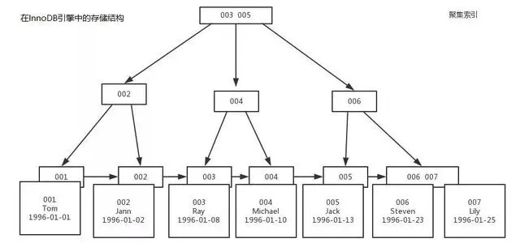
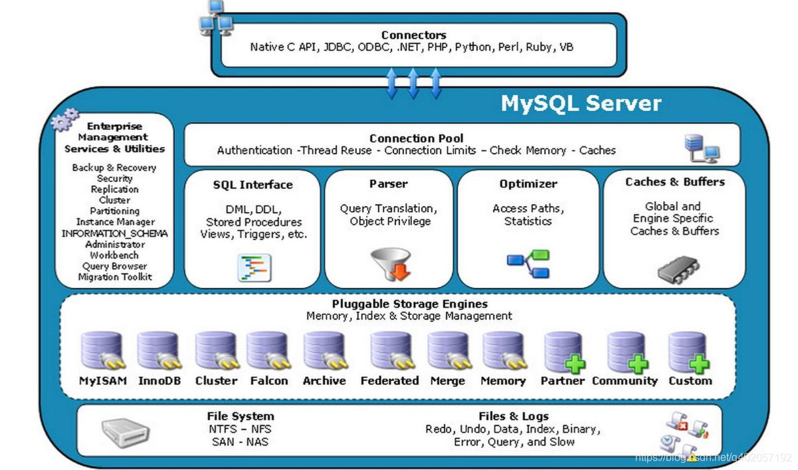
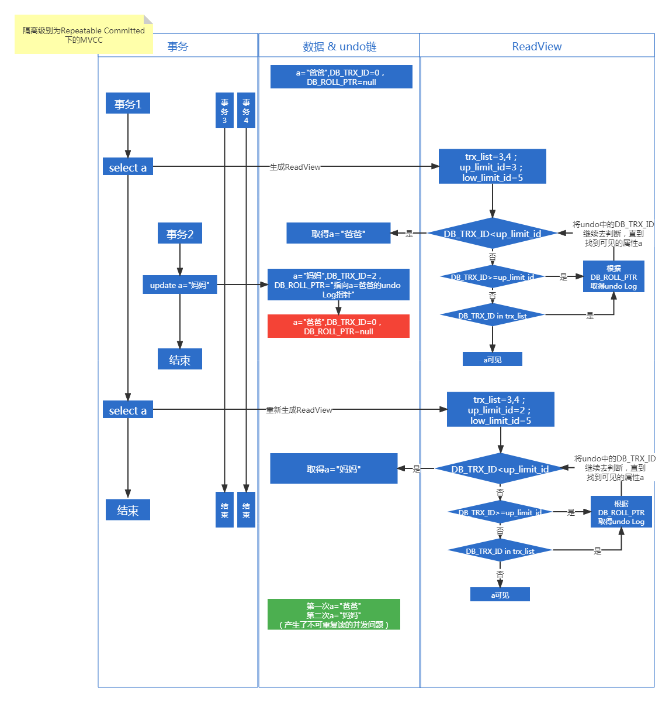
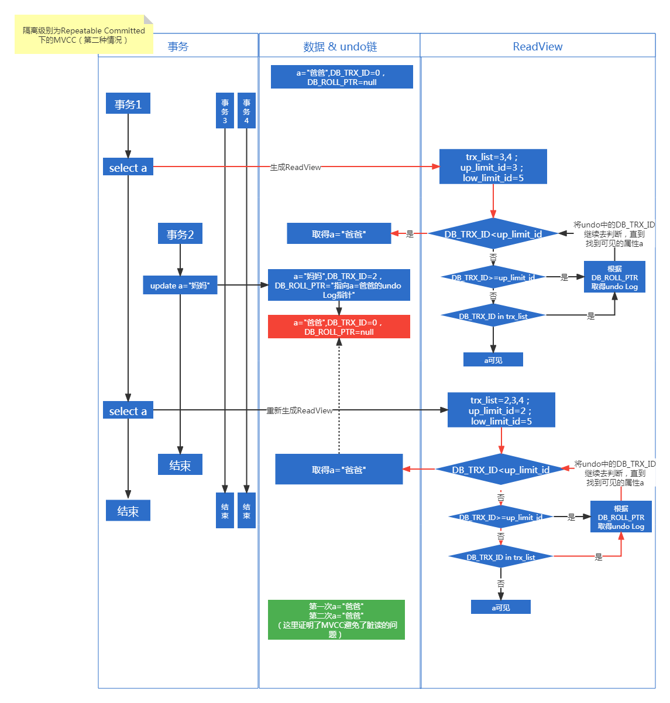
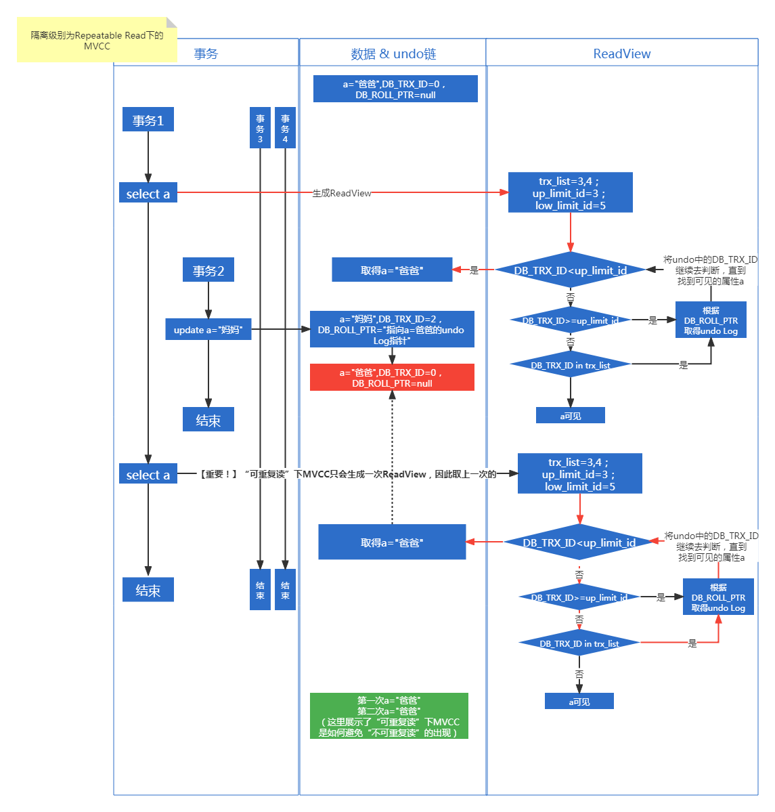
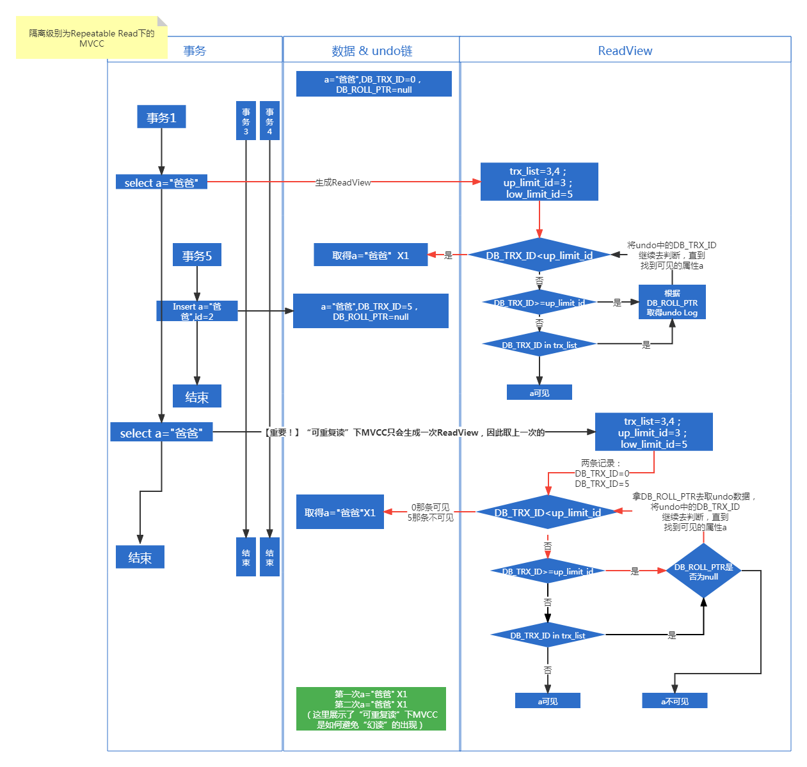
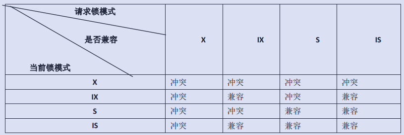

## MYSQL数据库速查宝典

***目录***
[toc]


#### 函数 Function
##### （1）创建Function

```sql
DELIMITER $$
DROP FUNCTION IF EXISTS genPerson$$
CREATE FUNCTION genPerson(name varchar(20)) RETURNS varchar(50)
BEGIN
  DECLARE str VARCHAR(50) DEFAULT '';
  SET @tableName=name;
  SET str=CONCAT('create table ', @tableName,'(id int, name varchar(20));');
  return str;
END $$
DELIMITER ;
```

#### 存储过程 PROCEDURE
##### （1）创建PROCEDURE
```sql
--与创建函数的语法基本一致，有以下地方不一样：
--1."create function"改为"create procedure"
--2.procedure没有返回值(没有return)
```

#### 其他运维需求

```sql
--查看是否自动提交
show variables like 'autocommit';

--查看正在执行的事务（其中，trx_mysql_thread_id为线程ID）
SELECT * FROM information_schema.INNODB_TRX;

--杀死mysql线程（线程ID）
kill [线程id];

-- 查看正在锁的事务
SELECT * FROM INFORMATION_SCHEMA.INNODB_LOCKS;

-- 查看等待锁的事务
SELECT * FROM INFORMATION_SCHEMA.INNODB_LOCK_WAITS;

```

#### 索引
##### Mysql有哪些索引？

**逻辑分类**  
普通索引  
唯一索引（索引的值必须唯一，可以为null）  
主键索引（索引的值必须唯一，但不能为null）  
全文索引（只有MyISAM存储引擎支持）  
组合索引  
空间索引  

**物理分类**  
聚簇索引：索引与数据保存在一起（主键索引就是一个聚簇索引，若无定义主键，InnoDB会隐式定义一个主键。叶子节点就是一行的所有字段）   
非聚簇索引：索引与数据分开保存（索引树的叶子节点是数据的ID（InnoDB）或数据的物理地址（MyIsam），取得ID后还需要去聚簇索引再查一遍）  
&nbsp;   
&nbsp;   

##### 什么是覆盖索引？

覆盖索引指的是在一次查询中，如果一个索引包含或者说覆盖所有需要查询的字段的值，我们就称之为覆盖索引，而不再需要回表查询。  
而要确定一个查询是否是覆盖索引，我们只需要explain sql语句看Extra的结果是否是“Using index”即可。  
&nbsp;   
&nbsp;   
##### 什么时候需要建立索引？
* 主键（自动创建索引）
* 频繁作为查询条件的字段
* 作为其他表的外键的字段
* order by的字段
* group by的字段
&nbsp;   
&nbsp;   
##### 如何命中索引？如何不命中索引？

**可以**  
1. Union、in、or可以命中索引
2. 联合索引最左前缀原则：假设建立了（A,B,C）索引，则可以加快（A）、（A、B）、（A、B、C）三组的查询，（B、C）、（C）则不可以。
3. 只能有范围列能走到索引。范围查询条件包括：<、<=、>、>=、between

**不能**  
1. 前导模糊查询不能命中索引（like '%Haha'）
2. 负条件查询不能命中索引（！=、<>、not in、not exists、not like等）
3. 含计算条件的不能命中索引(name='123'+'456')
4. 强制类型转换的不能命中索引(name=123,name为string类型)
&nbsp;   
&nbsp;   
##### mysql索引是什么数据结构？
参考：[https://blog.csdn.net/qq_37102984/article/details/124296196](https://blog.csdn.net/qq_37102984/article/details/124296196)  
InnoDB引擎的索引，使用的是B+树。  

&nbsp;   
其中的每个树节点就是一个InnoDB页，每个InnoDB页的大小默认为16KB（可以通过参数配置）。  
也就是说，InnoDB的索引的非叶子节点大小是16KB，叶子节点大小也是16KB。  
&nbsp;   
非叶子节点：存储的是“键(bigint)+指针(6B)”，一个非叶子节点能存1170个指针（也就是说可以有1170个子节点）  
> bitint = 8B, 16KB = 16 x 1024B, 因此能存储： 16 x 1024 / (8+6)  = 1170   

&nbsp;   
叶子节点：存储的是具体的行数据，能存多少行要看具体表有多少个字段。  
我们假设一行数据占1KB，则一个叶子节点能保存16行数据。  
&nbsp;   
因此：   
1层 ----- 0行数据  
2层 ----- 1170 * 16 = 18720行数据  
3层 ----- 1170 * 1170 * 16 = 21902400行数据（约2kw数据）  
4层 ----- 1170 * 1170 * 1170 * 16 = 25625808000（约250亿数据）  

> **为什么用B+树而不用B树？**  
> 因为B树的非叶子节点存的是行数据，而不是“键+指针”，B+树的非叶子节点不保存行数据，只保存键。  
> 若用B树，非叶子节点存的是行数据，则每个非叶子节点最多只能存16行，从而使得树的深度变高，遍历次数也会变多。  


#### 数据类型
**bigint**
数值范围：-2^63 ~ 2^63-1（即-9,223,372,036,854,775,808到 9,223,372,036,854,775,807） 
最大数值：9百多万兆（1兆=1万亿）  
存储大小：8字节  
最大长度（位数）：19  

**int**
数值范围：-2^31~2^31-1（即-2 147 483 648到2 147 483 647）  
最大数值：20多亿  
存储大小：4字节  
最大长度（位数）：10  

**smallint**
数值范围：-2^15 ~ 2^15 – 1 (即-32,768 到32,767)  
最大数值：3万2千多  
存储大小：2字节  
最大长度（位数）：5  

**tinyint**
数值范围：0 ~ 2^9 – 1 (即0到255)  
最大数值：255  
存储大小：1字节  
最大长度（位数）：3  

**varchar**
【latin1字符集】  
存储大小：字符数N + (1 or 2)  

【utf8字符集】  
存储大小：字符数N x 3字节 + (1 or 2)  

> 为什么后面还要加上1or2?因为除了需要保存字符串的内容，还要保存当前字符串的长度（字节数）。  
> 用1个字节可以表示1~255。当字符串的长度（字节数）超过255，就要用2个字节表示。

&nbsp;  
假设：name字段为varchar(200)，意思是可以保存200个字符，那么保存'aaaa'需要用多少字节？  
&nbsp;  
latin1字符集下，因为200个字符只需200个字节保存，200<255，因此只需用 200 + 1 = 201 byte；  
utf8字符集下，因为200个字符需要3*200=600个字节保存，600>255，因此需要用 200 * 3 + 2 = 602 byte；  

#### 性能
```sql
show global status ;
--通过该SQL可查看当前数据库的运行情况。
```

| Variable_name     | Value | Mean|Default|
| ---|---|---|---|
| Threads_connected | 57    |当前连接数|
| Threads_running   | 4     |当前并发数|
| max_connections | 1000  |最大可支持的连接数|
|Max_used_connections | 2  |实际经历最大连接数|

#### Mysql的体系结构


* 客户端：Mysql驱动
* 服务端：
   *  内存：
      *  连接池
      *  SQL接口
      *  管理工具和服务
      *  解析器
      *  优化器
      *  缓存池
      *  插件式存储引擎
          *  InnoDB引擎
   *  硬盘：
      *  参数文件
      *  数据文件
          * 表空间文件（ .idb，路径在innodb_data_file_path）
              * 段（segment，常见有数据段、索引段、回滚段等）
                  * 区（extent，1MB，包含64个页）
                      * 页（page）或称为块（block），默认每个页占16KB
                        数据页：B+树
                        索引页：B+树
                        数据索引页（InnoDB的数据索引放在一起）：B+树
                        Undo页：旧记录链表
      *  索引文件
      *  日志
          *  错误日志
          *  二进制日志（binlog，Mysql级别日志。记录update、insert等修改数据的请求，可用于主从复制和数据恢复）
          *  慢查询日志（记录查询时间超过n秒的请求）
          *  查询日志（所有sql请求）
          *  重做日志（redo日志，InnoDB特有。记录update、insert等修改数据的请求，可用于崩溃恢复）
          *  undo日志（当执行了update、insert后，会将旧数据保存到undo日志中，用于回滚）

###### Mysql线程
* 连接池线程（调用SQL接口、解析器、优化器、存储引擎）
* 存储引擎后台线程
   * Master Thread（将数据异步刷新到硬盘）
   * IO Thread（处理IO请求）
   *  Purage Thread（回收Undo页）
   *  Page Cleaner Thread
###### Mysql内存结构
* 全局内存：
缓存池（数据页（默认16K）、索引页、锁信息、插入缓存等等）、重做日志缓存、额外的内存池
* 线程内存：
存储引擎内存池

###### Mysql文件结构

|引擎|表结构|数据|索引|
|---|---|---|---|
|MyISAM|.frm|.MYD|.MYI|
|InnoDB|.frm|.ibd|.ibd|
像MyISAM这样，数据与索引分开存放的，被称为非聚集索引  
像InnoDB，数据与索引存放在同一个文件内，被称为聚集索引  

###### 存储引擎
* InnoDB
MVCC（多版本并发控制）  
next-key-locking避免幻读  
行锁  
非锁定读  
插入缓冲  
二次读  

* MyISAM
表锁  
不支持事务  
缓冲池只缓冲索引  

#### 事务
##### 隔离级别
* 读未提交（会有脏读）
* 读已提交（会有不可重复读）
* 可重复读（会有幻读）
* 串行读（一次只执行一个事务，没有并发事务就不会有上面的问题，但效率很慢）

Mysql默认的隔离级别是可重复读（select @@transaction_isolation）；  
通过多版本并发控制（MVCC）达到可重复读；  
通过并+间隙锁（Next-key Locking）防止幻读。  

##### 数据库的并发场景
* 读读（无需并发控制）
* 读写（可能会遇到脏读、不可重复读、幻读的问题）
* 写写（可能会遇到第一类更新丢失、第二类更新丢失的问题）

而读又分为两种：
* 当前读
   需要对读取的记录加锁的操作。包括：
    * 加共享锁：select lock in share mode
    * 加排他锁：select for update ; update, insert ,delete；
* 快照读
    不需加锁的select操作就叫快照读。

其中，MVCC解决 快照读-写 遇到的并发问题；  
间隙锁解决 当前读-写 遇到的并发问题；  
通过悲观锁（以排他锁实现）解决 写-写 遇到的并发问题。  


##### MVCC原理
参考：  
https://www.jianshu.com/p/29ca075763f0  
https://www.pdai.tech/md/db/sql-mysql/sql-mysql-mvcc.html  
***一种不需要加锁便可解决读写时遇到的并发问题的方案。***  

MVCC就是为了不加锁但同时还能解决读写时遇到的并发问题。这里的读指的是快照读。  

要知道，读的时候若不加锁，便会出现不可重复读、幻读的问题。  
MVCC就是通过行隐藏字段、Undo日志、ReadView（快照）来实现快照读，从而完成“不加锁解决读写问题”的任务的。  

InnoDB的行数据有两个重要的隐藏列：  
* DB_TRX_ID 最近一次修改该行数据的事务ID，有的也把这个称为“创建版本号”  
* DB_ROLL_PTR 一个指针，指向该行对应的undo链，有的也把这个称为“删除版本号”


MVCC在隔离级别为“读已提交（Repeatable Committed） ”下产生不可重复读的原理，如下图：  


> 说明：
> 1. undo链即undo日志，某行数据每被修改一次，就会将这次修改添加到undo链中，并记录是哪个事务修改的；这样不仅方便回滚，而且还能解决并发问题。
> 2. ReadView是内存快照，在每次select之前都会生成/取得一个ReadView，查看当前有哪些事务在运行等信息。
>   * trx_list:当前未提交的事务ID列表
>   * up_limit_id:记录trx_list列表中事务ID最小的ID
>   * low_limit_id:ReadView生成时刻系统尚未分配的下一个事务ID，也就是目前已出现过的事务ID的最大值+1
>   * ...
> 3. 每次select之前，mysql都会生成一个ReadView，并且遍历undo链，然后根据undo链中的DB_TRX_ID去判断取哪个版本的数据
> 4. 在隔离级别为“读已提交”下，因为每次select之前，都会生成一个ReadView，因此会产生不可重复读问题。


MVCC在隔离级别为“读已提交（Repeatable Committed） ”下不会产生脏读的原理，如下图：  


MVCC在隔离级别为“可重复读（Repeatable Read） ”下不会产生“不可重复读”的原理，如下图：  


> 说明：
> 在“可重复读'的隔离级别下，因为一个事务内select只会生成一个ReadView，所以不会产生不可重复读的问题。

InnoDB 的MVCC在隔离级别为“可重复读（Repeatable Read） ”下不会产生“幻读”的原理，如下图：  



##### 间隙锁原理
InnoDB的三种行锁算法：
* Record Lock（单行上锁）
* Gap Lock（间隙锁，锁一定范围，但不包括记录本身。为了解决幻读）


#### 执行计划

***获取某个SQL的执行计划***  
    EXPLAIN SELECT * FROM EMP;  
***看懂执行计划***  
* id（id值相同，由上到下执行；id越大，执行优先级越高）
* table（当前访问的表名）
* select_type（select子句的类型）
    * SIMPLE select中不包含子查询或者UNION
    * PRIMARY select中包含子查询，则最外层会被标记为PRIMARY
    * SUBQUERY SELECT或WHERE列表中包含子查询，则该子查询被标记为SUBQUERY
    * DERIVED FROM列表中包含子查询，则该子查询被标记为DERIVED
    * UNION select被放在UNION中时，该select被标记为UNION
* type（当前表内的访问方式）
    * ALL 全数据表扫描；
    * index 全索引表扫描；
    * RANGE 对索引表进行范围查找，常见于between和<、>；
    * INDEX_MERGE 合并索引，使用多个单列索引搜索；
    * REF 非唯一性索引扫描，常见于 = 或 in；
    * EQ_REF 唯一性索引扫描，常见于主键或唯一性索引；
    * CONST 常量，表最多有一个匹配行,因为仅有一行,在这行的列值可被优化器剩余部分认为是常数,const表很快,因为它们只读取一次。
    * SYSTEM 系统，表仅有一行(=系统表)。这是const联接类型的一个特例。
* key（用到的索引名）
* ref（引用到的上一个表的列）
* extra（）
        
性能由上到下，越来越高  
性能在 range 之下的基本都可以进行调优  

#### 参数

* 查询参数
```sql
show global variables ='innodb_max_undo_log_size';
show global variables like '%truncate%';
```

#### 集群
有哪些集群解决方案？
- 【官方】Mysql Replication：一主多从
- 【官方】Mysql Fabric：一主多从+故障转移+数据分片
- 【官方】Mysql Cluster：多主多从+故障转移+高可用+负载均衡+可伸缩性
- MMM：双主多从+故障转移
- 主从+Mycat（一主多从，Mycat中间件负责读写分离、分库分表）
- 双主+Keepalive（高可用方案）

###### Mysql Replication：主从模式

**主库与从库同步数据的原理？**

主库在正常情况下，会将insert、update等请求写入 binlog 日志，然后从库连接到主库之后，从库有一个IO 线程，将主库的 binlog 日志拷贝到自己本地，写入一个 relay 中继日志中。    
接着从库中有一个 SQL 线程会从中继日志读取 binlog，然后执行 binlog 日志中的内容，也就是在自己本地再次执行一遍 SQL。  

**Mysql Replication的优缺点？**
优点：
- 通过数据冗余，防止因单一主机导致的数据丢失
- 配合proxy，可以做到读写分离
- 从库可以使用不同的数据引擎、建立不同的索引
- 配置简单
缺点：
- 基于Mysql的主从数据同步方式（异步复制、半同步复制），会出现数据不一致的情况
- 不支持故障自动转移，若主节点宕机，则无法正常处理写请求
- 不能很好支持数据分片，分库分表
- 不支持负载均衡

###### Mysql Fabric
**优缺点**
优点：
- Mysql Replication的优点
- 单点故障可以自动切换
- 数据分片功能
缺点：
- 事务语句、查询语句不能跨分片
- 遇到节点故障，需要30秒或更长的恢复时间
- 写性能无法提升

> 什么是分片？
> 将整个数据库保存到多台服务器上，每台服务器上运行的Mysql就算一个分片。
> 每个分片保存这个数据库的一部分，保存表的一部分数据。
> 需要分片的表，需要配置一个分片键，Mysql Fabric通过分片键决定数据存到哪个分片上。

###### Mysql Cluster
**优缺点**
优点：
- 没有单点故障问题，故障恢复通常少于1s
- 读写性能都能扩展
- 支持水平扩展（分片），支持冗余存储数据
缺点：
- 架构及原理复杂
- 只能使用NDB存储引擎（事务隔离只支持读已提交）
- 对内存性能依赖大


###### 双主+Keepalive

#### 锁
参考：  
[https://zhuanlan.zhihu.com/p/29150809](https://zhuanlan.zhihu.com/p/29150809)  
[https://blog.csdn.net/w1014074794/article/details/126381482](https://blog.csdn.net/w1014074794/article/details/126381482)  
##### 什么是锁 
锁是mysql进程内存中的一种数据结构，mysql通过锁来控制不同事务访问数据行、数据表的权限。  

锁包含以下几个部分：  
* 锁所在的事务信息
* 索引信息
* 表锁或行锁信息
* type_mode(32bit)
    * lock_mode(锁模式，4bit)
        * LOCK_IS:共享意向锁
        * LOCK_IX:独占意向锁
        * LOCK_S:共享锁(读锁)
        * LOCK_X:独占锁(写锁)
        * LOCK_AUTO_INC:AUTO_INC锁
    * lock_type(锁类型，4bit)
        * LOCK_TABLE:表级锁
        * LOCK_REC:行级锁
    * lock_wait(是否在等待资源，1bit)
        * NOT_WAITING:没有在等待资源
        * WAITING:在等待资源
    * rec_lock_type(行锁具体类型，23bit)
        * LOCK_ORDINARY:next_key锁
        * LOCK_GAP:gap锁
        * LOCK_REC_NOT_GAP:记录锁
        * LOCK_INSERT_INTENTION:插入意向锁
        * ...
* 其他信息
* 与heap_no对应的比特位


##### 锁的作用

解决并发问题（脏读、不可重复读、幻读）

##### 什么时候用到锁

一般在执行sql、事务、存储过程时，就会用到锁。

一般不用在SQL语句中显式写明用什么锁，Mysql会自动为操作上锁。  

使用不通的存储引擎，自动加锁的规则也不一样：  

**MyIsam引擎** 

只支持表级锁。  

Select操作：自动给涉及的表加读锁；
Update、Delete、Insert：自动给涉及的表加写锁；


**InnoDB引擎**

除了有排它行锁（X）、共享行锁（S）外，还有两种表锁：意向排它锁（IX）、意向共享锁（IS）  



SELECT：InnoDB 不会加任何锁；  
UPDATE、 DELETE 和 INSERT：自动给涉及数据集加排他锁（X)；  

>**InnoDB只有走了索引才会使用行锁！！**
>InnoDB 行锁是通过给索引上的索引项加锁来实现的，这一点 MySQL 与  
>Oracle 不同，后者是通过在数据块中对相应数据行加锁来实现的。InnoDB 这种  
>行锁实现特点意味着：只有通过索引条件检索数据，InnoDB 才使用行级锁，否>则，InnoDB 将使用表锁！


如果想手动加锁，则可通过以下两种方法：
```sql
select ... lock in share mode //共享锁(读锁) 
select ... for update //排他锁 (写锁)
```

##### mysql有哪些锁

从两个维度去看锁的属性：
1. Mysql使用什么引擎（表级锁、行级锁、页面锁）
2. 用户对Mysql执行了什么请求（独占锁、排他锁）
* 独占锁、排它锁（写锁）：其他事务不能读取，也不能写。
* 共享锁（读锁）：其他事务可以读，但不能写。

##### 不同引擎对应的锁粒度
* 表级锁：指锁住整个表。开销小，加锁快；不会出现死锁；锁定粒度大，发生锁冲突的概率最高，并发度最低。
    > 支持引擎：MyISAM（默认）、 MEMORY（默认）、BDB引擎、InnoDB引擎

* 行级锁：指锁住某一行。开销大，加锁慢；会出现死锁；锁定粒度最小，发生锁冲突的概率最低，并发度也最高。
    > 支持引擎： InnoDB引擎（默认）
    
* 页面锁：指锁住某些行。开销和加锁时间界于表锁和行锁之间；会出现死锁；锁定粒度界于表锁和行锁之间，并发度一般
    > 支持引擎： BDB引擎（默认）

##### 上锁的场景（innodb引擎，默认是可重复读）

```sql
update user set age = 10 where id = 49; -- id是聚簇索引
```

1.根据id更新，若有对应的记录，则会上记录行锁(lock_type=LOCK_REC,rec_lock_type=LOCK_REC_NOT_GAP)  
2.若不存在对应记录，则需要在查询id所在的索引间隙添加间隙锁Gap Lock(lock_type=LOCK_REC,rec_lock_type=LOCK_GAP)  


```sql
update user set age = 10 where id between 10 and 20; -- id是聚簇索引
```

基于主键（聚簇索引）进行范围查询时，采用Next Key Lock添加行锁(lock_type=LOCK_REC,rec_lock_type=LOCK_ORDINARY)  


```sql
update user set age = 10 where name = 'Tom'; -- name字段上有索引
```

1. 基于辅助索引查询时，会先对辅助索引加锁，再对聚簇索引加锁
2. 聚簇索引上加锁算法采用Record Lock，即只锁记录不锁间隙


```sql
update user set name = 'Tom' where age = 10;  -- age上没有索引
```

查询不走索引时，会在聚簇索引上加锁，加锁算法采用Next Key Lock，并且会锁定全表范围。


##### 上锁规则总结

1. InnoDB中默认采用Next Key Lock加锁，Next Key Lock加锁范围前开后闭。
2. 行锁都是加在索引上，如果通过聚集索引查询则在聚集索引上加锁，通过辅助索引查询则需要同时在辅助索引和聚集索引上加锁，不走索引则在聚集索引上加锁。
3. 查找过程中访问到的索引才会加锁。注意是访问到的索引而不是满足查询条件的索引。
4. 基于主键和唯一索引进行等值查询，Next Key Lock会退化为行锁Record Lock。
5. 索引上的等值查询，没有满足条件的记录时，Next-key lock退化为间隙锁，加锁范围是查询值所在的间隙。
6. 通过辅助索引查询并加锁时，需要进行回表查询然后在聚集索引上采用行锁Record Lock加锁。
7. 范围查询采用Next Key Lock加锁。
