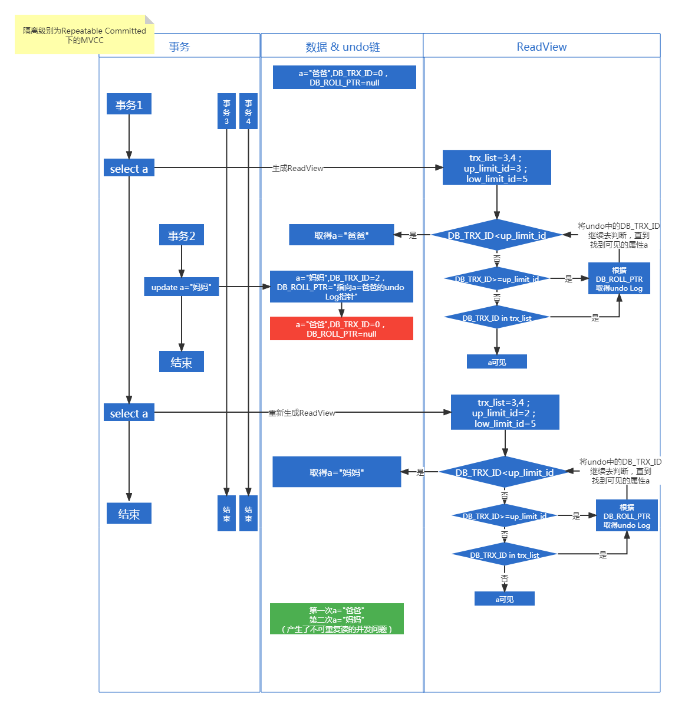
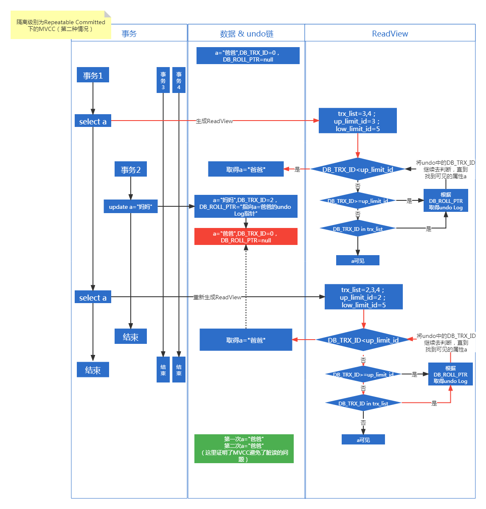
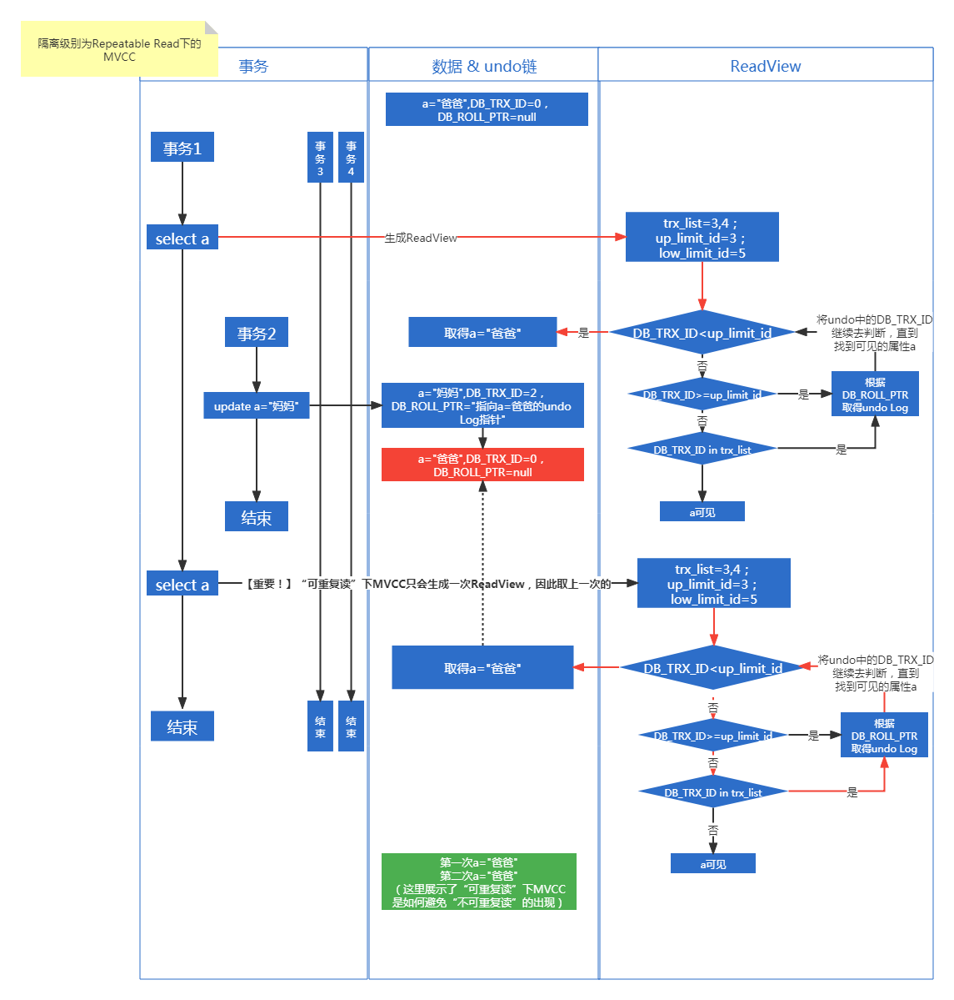
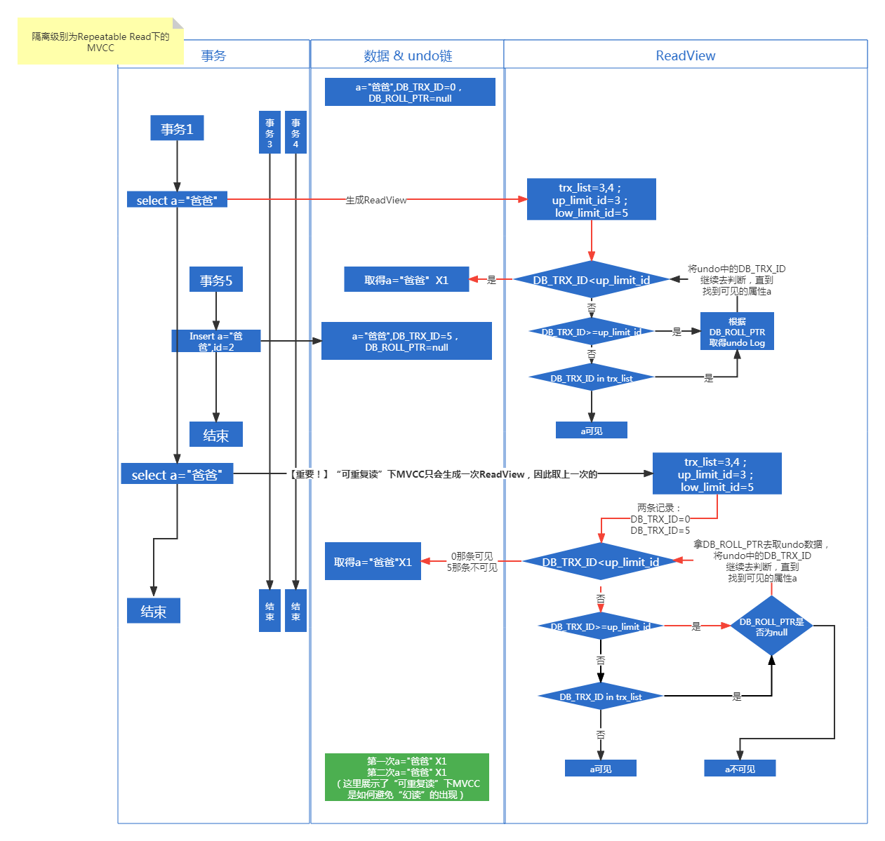

#### 数据库

##### SQL语句调优
1. 查询SQL慢日志
  * 看慢日志相关参数：slow_query_log（慢日志开关，默认关闭） 、slow_query_log_flie（慢日志文件路径） 、long_query_time （慢查询时间，即多久才算慢sql）

  ```sql
  show variables like '%quer%';
  ```
  * 先打开慢日志开关参数：slow_query_log
  ```sql
   set global slow_query_log = on; #打开慢查询  立即设置立即生效

   set global long_query_time = 1; #设置慢查询时间 单位 s (秒)  重新连接MySql客户端才能生效
  ```
  * 查看慢SQL数量
  ```sql
  show status like '%slow_queries%';
  ```
  * 查看慢SQL
  ```bash
  #可以看到SQL执行的时间，以及是哪个SQL语句
  vim /usr/local/mysql/data/baidudeMacBook-Pro-slow.log
  ```

2. 使用Explain等工具分析sql
  若发现type中有“ALL”或者“INDEX”，则证明走了全表扫描，则需要优化一下SQL

3. 优化方法
- 添加索引（where和order by中有的字段）
- where条件的顺序，顺序不对可能导致不走索引
- where条件中，等号左右两边数据类型不一致
- where a=null干掉
- where a like '%bbb' 干掉


##### 常见SQL题目
###### 求每个学生分数最高的科目
表：dyz.t_score(id,score,name,subject)
```sql

--用子查询先求出每个学生的最高分
select t1.* from dyz.t_score t1,
(select max(score) score,name from dyz.t_score group by name) t2 where t1.name = 
t2.name
and t1.score=t2.score;
```
###### 求每个学生的语文、数学、英语成绩，在同一行中显示（行转列）
```sql
select name,
max(case subject when '语文' then score else null end) '语文',
max(case subject when '数学' then score else null end) '数学',
max(case subject when '英语' then score else null end) '英语',
 from dyz.t_score group by name;
```

###### 求每个学生最近的一次语文成绩
表：dyz.t_score(id,score,name,subject,create_date)
```sql
select 
 t1.name,
 t1.subject,
 t1.score 
from dyz.t_score t1,
(select max(id) from dyz.t_score 
where subject ='语文'
group by name) t2 
where t1.id = t2.id 
```

##### 数据库索引一般用什么数据结构？数据一般用什么数据结构？
关系型数据库，索引一般用B+树，数据一般用B+树；
为什么用B+树？
1. 时间复杂度需要Logn ： AVL树、B树、B+树；
2. 树高需要更低：B树、B+树；
3. 非叶子节点不存数据（每一页可存更多节点）、叶子节点间有指针（方便扫描遍历）：B+树

mongodb索引用B树，数据用文件存储？


##### Mysql有哪些索引？
普通索引
唯一索引（索引的值必须唯一，可以为null）
主键索引（索引的值必须唯一，但不能为null）
全文索引（只有MyISAM存储引擎支持）
组合索引
空间索引

##### 什么是聚簇索引、非聚簇索引？
聚簇索引：数据库表中数据的物理顺序与键值的逻辑（索引）顺序相同；索引与数据保存在一起（主键索引就是一个聚簇索引，若无定义主键，InnoDB会隐式定义一个主键。B-树、B+树）
非聚簇索引：索引与数据分开保存（索引树的叶子节点是数据的ID（InnoDB）或数据的物理地址（MyIsam），取得后还要根据结果再去查询）

Mysql的InnoDB引擎用的就是聚簇索引。用.frm文件保存创建表的语句，用.idb文件保存表的索引和数据；
MyIsam引擎则用非聚簇索引。用.frm文件保存创建表的语句，用.MYD文件保存表的数据，用.MYI文件保存表的索引；


##### 什么是覆盖索引？
覆盖索引指的是在一次查询中，如果一个索引包含或者说覆盖所有需要查询的字段的值，我们就称之为覆盖索引，而不再需要回表查询。
而要确定一个查询是否是覆盖索引，我们只需要explain sql语句看Extra的结果是否是“Using index”即可。

##### Mysql在执行sql更新时，底层的流程是怎么样的
1. 客户端进程（驱动）与Mysql服务端进程建立连接（进程间通信）
2. 客户端发出SQL请求，服务端分出线程处理请求
3. 缓存：服务端线程先查缓冲池，命中则直接返回
4. 解析器、优化器：没命中，则通过解析器、优化器生成执行计划
5. 执行器：调用存储引擎去执行（下面以InnoDB为例）
6. InnoDB存储引擎：从硬盘取数据页到缓存池，再在缓存池内从数据页中查找需要的数据，查不到则继续从硬盘取下一个页到缓存池，继续搜索。
7. InnoDB存储引擎：若查到，先将旧数据保存到undo缓存中（以防需要回滚）
8. InnoDB存储引擎：在页中对数据进行修改
9. InnoDB存储引擎：再将修改后的数据保存到redo缓存中（以备数据恢复）
10. InnoDB存储引擎：事务提交后，将redo缓存写回redo日志（硬盘）和binlog日志（硬盘）中，最后在redo日志中写入本次修改在binlog的位置，并添加上commit标记
11. InnoDB存储引擎：通过InnoDB的后台线程将修改后的数据定时刷新回硬盘

（另有说法：8应在10之后完成，即应先写redo log，再在页中对数据进行修改）

##### mysql事务隔离级别、存储引擎，索引结构和类型
事务隔离级别：
* 读未提交（修改：排他锁；读取：不加锁。但修改后，事务未提交便释放锁，导致脏读：其他事务可读取到未提交的修改）
 解决方法：事务提交后再释放排他锁。
* 读已提交（修改：排他锁；读取：不加锁。但读取时，允许其他事务修改数据，导致不可重复读：即事务A先读取了数据，但事务B之后立即将数据修改了，导致事务A第二次读取时发现数据不一致）
解决方法：
    1. 针对需要加锁的操作（当前读）：数据读取时加共享锁。使数据读取时不能被修改。
    2. 针对不需要加锁的操作（快照读）：MVCC
* 可重复读（修改：排他锁；读取：共享锁。）
发生幻读的例子：
    1. select * from t where a=1时 查出一条记录 a:1 b:2
    2. 其他事务往t表中插入1条a:1 b:3
    3. 若再查询select * from t where a=1时 此时会查出两条记录 a:1 b:2 | a:1 b:3
    4. 第两次查询发现有新内容，便称为幻读
 解决方法：
    1. 针对需要加锁的操作（当前读）：数据读取时加间隙锁
    2. 针对不需要加锁的操作（快照读）：MVCC

* 串行读
    所以事务均以串行执行，这样就不会有并发问题。

***四个隔离级别：***
* 读未提交（会有脏读）
* 读已提交（会有不可重复读）
* 可重复读（会有幻读）
* 串行读（一次只执行一个事务，没有并发事务就不会有上面的问题，但效率很慢）

Mysql默认的隔离级别是可重复读（select @@transaction_isolation）；
以下是配置了不同隔离级别时，Mysql使用锁的情况。
通过多版本并发控制（MVCC）达到可重复读；
通过并+间隙锁（Next-key Locking）防止幻读。

|||读未提交（Read Uncommitted）|读已提交（Read Commited）|可重复读（Repeatable Read）|可串行化（Serializable）|
|---|---|---|---|---|---|
|SQL|where|
|select|相等|无锁| consistent read（MVCC）|consistent read（MVCC）| 共享锁(share lock)|
|select|范围|无锁| consistent read（MVCC）|consistent read（MVCC）| 共享间隙锁（share next-key）|
|update|相等|独占锁(exclusive lock)| 独占锁|独占锁| 独占锁|
|update|范围|独占间隙锁（exclusive next-key）| 独占间隙锁|独占间隙锁| 独占间隙锁|
|insert| - |独占锁(exclusive lock)| 独占锁|独占锁| 独占锁|
|replace|无键冲突|独占锁(exclusive lock)| 独占锁|独占锁| 独占锁|
|replace|有键冲突|独占间隙锁（exclusive next-key）| 独占间隙锁|独占间隙锁| 独占间隙锁|
|delete|相等|独占锁(exclusive lock)| 独占锁|独占锁| 独占锁|
|delete|范围|独占间隙锁（exclusive next-key）| 独占间隙锁|独占间隙锁| 独占间隙锁|
|select...from lock in share mode|相等|共享锁（share lock）|共享锁|共享锁|共享锁|
|select...from lock in share mode|范围|共享锁（share lock）|共享锁|共享间隙锁（share next-key）|共享间隙锁|
|select...for update|相等|独占锁(exclusive lock)| 独占锁|独占锁| 独占锁|
|select...for update|范围|独占锁(exclusive lock)| 共享锁（share lock）|独占间隙锁（exclusive next-key）| 独占间隙锁|

***数据库的并发场景：***
* 读读（无需并发控制）
* 读写（可能会遇到脏读、不可重复读、幻读的问题）
* 写写（可能会遇到第一类更新丢失、第二类更新丢失的问题）

而读又分为两种：
* 当前读
   需要对读取的记录加锁的操作。包括：
    * 加共享锁（读锁）：select lock in share mode
    * 加排他锁（写锁）：select for update ; update, insert ,delete；
* 快照读
    不需加锁的select操作就叫快照读。

其中，MVCC解决 快照读-写 遇到的并发问题；
间隙锁解决 当前读-写 遇到的并发问题；
通过悲观锁（以排他锁实现）解决 写-写 遇到的并发问题。


###### MVCC原理
参考：
https://www.jianshu.com/p/29ca075763f0
https://www.pdai.tech/md/db/sql-mysql/sql-mysql-mvcc.html
***一种不需要加锁便可解决读写时遇到的并发问题的方案。***

MVCC就是为了不加锁但同时还能解决读写时遇到的并发问题。这里的读指的是快照读。

要知道，读的时候若不加锁，便会出现不可重复读、幻读的问题。
MVCC就是通过行隐藏字段、Undo日志、ReadView来实现快照读，从而完成“不加锁解决读写问题”的任务的。

InnoDB的行数据有两个重要的隐藏列：
* DB_TRX_ID 最近一次修改该行数据的事务ID，有的也把这个称为“创建版本号”
* DB_ROLL_PTR 一个指针，指向该行对应的undo链，有的也把这个称为“删除版本号”

事务在完成一个快照读请求后（select * from ....），内存中便会生成一条快照（ReadView）。

快照中保存着以下信息：
* trx_list：事务1执行快照读那刻系统正活跃的事务ID
* up_limit_id：trx_list列表中事务ID最小的ID
* low_limit_id：trx_list列表中下一个事务ID，也就是目前已出现过的事务ID的最大值+1

MVCC在隔离级别为“读已提交（Repeatable Committed） ”下产生不可重复读的原理，如下图：




MVCC在隔离级别为“读已提交（Repeatable Committed） ”下不会产生脏读的原理，如下图：


MVCC在隔离级别为“可重复读（Repeatable Read） ”下不会产生“不可重复读”的原理，如下图：


InnoDB 的MVCC在隔离级别为“可重复读（Repeatable Read） ”下不会产生“幻读”的原理，如下图：


###### mysql是如何上锁的？


##### mybatis
###### 调用sql的原理
1. 通过@MapperScan(basePackages = "sample.jdbc.mapper")，将所有Mapper接口纳入Mybatis的管理；
2. 调用Mapper，有以下几种情况：
* 通过Spring调用，则直接Autowired一个Mapper变量即可；
* 通过Session调用
```java
InputStream inputStream = Resources.getResourceAsStream("SqlMapConfig.xml");
// 构建sqlSessionFactory
SqlSessionFactory sqlSessionFactory = new 
SqlSessionFactoryBuilder().build(inputStream);
// 获取sqlSessionSqlSession sqlSession = sqlSessionFactory.openSession();
Map<String,Object> parameters = new HashMap<String,Object>();
parameters.put("testid","1");
TestVo test = sqlSession.selectOne(
"sample.jdbc.mapper.TestMapper.getTestById",parameters);

```

3. DefaultSqlSession->Configuration->
MapperRegistry->MapperProxyFactory
最后是由MapperProxyFactory根据全类名生成一个代理类。


###### Mybatis如何实现分页？
* 直接在SQL中加入分页语句
* 通过mybatis的插件机制，写一个拦截器，拦截需要分页的函数，拦截成功后会自动在sql中添加分页语句。
* 使用mybatisplus，注册一个mp自带的拦截器Bean（PaginationInteceptor），只要入参中有Page，则会自动分页。原理跟上面一样。
* 依赖pagehelper，pagehelper原理跟上面一样。（推荐）
```java
//查询前添加以下这段代码，则会自动分页
PageHelper.startPage(0,10);
```

###### 如何分页的同时返回总数？
1. 使用PageHelper框架
```java
//添加分页
PageHelper.startPage(1,10);
//查询
List<User> users = userMapper.selectAll();
//将查询出来的数据放进PageInfo中
PageInfo<User> pageInfo = new PageInfo<>(users);
//取出当前页、页大小、总数、数据
Integer pageNum = pageInfo.getPageNum();
Integer pageSize = pageInfo.getPageSize();
Integer sum = pageInfo.getTotal();
List<User> pageusers = pageInfo.getList();
```
###### PageHelper如何手动分页？

```
int currentPage = 1;
PageInfo<User> pageInfo = null;

do{
  PageHelper.startPage(currentPage,10);
  List<User> users = userMapper.selectAll();
  pageInfo = new PageInfo<>(users);

  //do something...

}while(pageInfo == null || pageInfo.isHaveNextPage())


```

###### mybatis如何批量插入大量数据，性能最好？
 
 参考：[https://blog.csdn.net/blueheartstone/article/details/126602810](https://blog.csdn.net/blueheartstone/article/details/126602810)


###### mybatis的一级缓存、二级缓存
一级缓存：作用域为session。通过HashMap存储。session关闭后，缓存清空；
```java
         SqlSession sqlSession=sqlSessionFactory.openSession(true);                //true后是自动提交       
         String statement="procedure.getUser";
         CUser cuser=sqlSession.selectOne(statement, 1);
         System.out.println(cuser);
         //再跑一次
         cuser=sqlSession.selectOne(statement, 1);
         System.out.println(cuser);
         //看日志会发现只查询了一次数据库
```
二级缓存：作用域为Mapper。通过HashMap存储。session提交或关闭后，一级缓存的数据会保存到二级缓存中。
```java
         SqlSession sqlSession1=sqlSessionFactory.openSession(true);                //true后是自动提交     
         SqlSession sqlSession2=sqlSessionFactory.openSession(true);                //true后是自动提交     
         String statement="procedure.getUser";
         CUser cuser=sqlSession1.selectOne(statement, 1);
         System.out.println(cuser);
         //再跑一次
         cuser=sqlSession2.selectOne(statement, 1);
         System.out.println(cuser);
         //看日志会发现只查询了一次数据库
```
如何开启&关闭？
一级缓存：默认开启；
```xml
<!-- mybatis.cfg.xml-->
<setting name="localCacheScope" value="SESSION"/>
<!-- 
SESSION：开启;
STATEMENT：关闭；
-->
```


要开启二级缓存，需要满足以下几点：默认不开启
* 一级缓存开启 "<setting name="cacheEnabled" value="true"/>" 
* 去mapper.xml中配置使用二级缓存：<cache></cache>
* 我们的POJO需要实现序列化接口

一级缓存失效的场景：
* sqlsession不同；
* sqlsession相同，但查询没有的数据；
* sqlsession相同，但两次查询之间有增删改操作；（每个增删改标签都有默认清空缓存配置：flushCache="true"）
* sqlsession相同，但手动清除了一级缓存（缓存清空）

###### mysql的动态sql标签

trim | where | set | foreach | if | choose| when |
otherwise | bind

示例：
```xml
<!--if的用法-->
<select id="findActiveBlogLike"
     resultType="Blog">
  SELECT * FROM BLOG WHERE state = ‘ACTIVE’
  <if test="title != null">
    AND title like #{title}
  </if>
  <if test="author != null and author.name != null">
    AND author_name like #{author.name}
  </if>
  </select>
  
  
  <!-- choose when otherwise的用法-->
<select id="findActiveBlogLike"
     resultType="Blog">
  SELECT * FROM BLOG WHERE state = ‘ACTIVE’
  <choose>
    <when test="title != null">
      AND title like #{title}
    </when>
    <when test="author != null and author.name != null">
      AND author_name like #{author.name}
    </when>
    <otherwise>
      AND featured = 1
    </otherwise>
  </choose></select>
```

###### mybatis如何实现批量的关联查询？

假设有公司表和部门表。有一个接口，需要根据查询条件，批量查出公司信息，并且其中有一列需要显示公司的所有部门（用逗号隔开），怎么实现？


首先，mybatis的关联查询分为：联合查询和嵌套查询。

**联合查询**
```xml
<!--一对一时：-->
<association property="属性名" javaType="全类名">
<id column="id" property="id"/>
<result column="name" property="name"/>
<association/>
<!--一对多时：-->
<collection property="属性名" javaType="全类名">
<id column="id" property="id"/>
<result column="name" property="name"/>
</collection>
```
**嵌套查询**
```xml
<!--一对一时：-->
<association property="属性名" select="select标签的id"></>
<!--一对多时：-->
<collection property="属性名" select="select标签的id"></>
```


